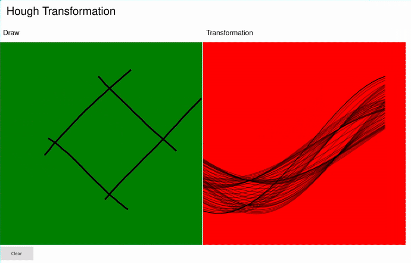

[](https://github.com/Linbreux/Hough-Transformation/actions/workflows/build.yml)

# Hough Transformation in QT

This project visualizes the Hough transformation in real time using QT. The application provides an interactive interface where users can draw on a canvas and observe the corresponding Hough transformation in a separate window.



## Features

- **Drawing Canvas:** On the left side, users can draw arbitrary shapes or lines.
- **Hough Transformation Window:** On the right side, the transformed representation of the drawn shapes is displayed.
- **Interactive Line Display:** When hovering over the Hough transformation window, a corresponding line is highlighted in the drawing canvas, helping to understand the relationship between points in Hough space and lines in the drawing space.

## Development
```bash
nix develop
just build
```

## Running
```bash
# using Development
nix develop
just build::build_run

# using nix
nix run
# or (without needing to clone)
nix run github:Linbreux/Hough-Transformation
```

## How It Works
- As you draw on the left canvas, the right window updates to show the Hough transformation in real time.
- The transformation window represents lines in polar coordinates (ρ, θ).
- Hovering over the transformation window highlights the corresponding line in the drawing canvas.

## Contributions
Contributions and improvements are welcome! Feel free to fork the repository and submit a pull request.

---

For any questions or issues, please open an issue on GitHub or contact me directly.
